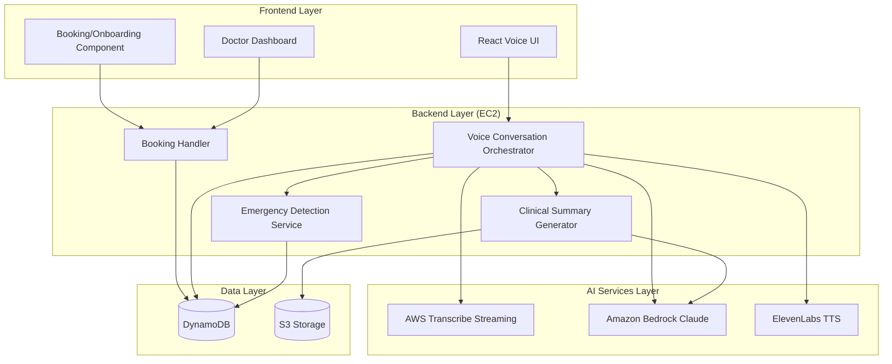

# Design Document: SymptomScribe

## Overview

SymptomScribe is an AI-powered pre-visit symptom screening tool that enables patients to complete voice-based symptom assessments before telehealth appointments. The system orchestrates real-time voice conversations between patients and an AI agent, processes natural language symptom descriptions, and generates structured clinical summaries for healthcare providers.

The architecture follows a monolithic backend approach with clear separation between frontend components, backend business logic, and external AI service integrations. The system leverages AWS services for scalability and reliability while maintaining sub-3-second response times for natural conversation flow.

**Key Design Principles:**
- **Real-time Processing**: End-to-end voice conversation with minimal latency
- **Safety-First**: Hardcoded emergency detection with zero hallucination risk
- **Demonstration Focus**: Clear disclaimers and synthetic data usage
- **Scalable Architecture**: Support for concurrent patient sessions
- **Clinical Accuracy**: Structured summary generation following medical documentation standards

## Architecture

The system employs a monolithic backend architecture with third-party AI service integrations:



**Architecture Layers:**

1. **Frontend Layer**: Browser-based React applications for booking, patient voice interface, and doctor dashboard
2. **Backend Layer**: Single EC2 application server orchestrating all business logic and external service calls
3. **AI Services Layer**: External AI services for speech processing and conversation management
4. **Data Layer**: Persistent storage for sessions, conversations, and clinical summaries

## Components and Interfaces

### Booking/Onboarding Component

**Purpose**: Handles the patient appointment booking flow and pre-visit screening entry point.

**Key Responsibilities:**
- Display appointment confirmation with pre-visit screening option
- Present time estimates and disclaimers for the screening process
- Initialize voice UI when patient chooses to start screening
- Handle patient decline and proceed to normal appointment flow

**Interface:**
```typescript
interface BookingHandler {
  confirmAppointment(patientId: string, appointmentDetails: AppointmentDetails): Promise<BookingConfirmation>
  presentPreVisitOption(appointmentId: string): Promise<PreVisitOption>
  initializeVoiceScreening(patientId: string, appointmentId: string): Promise<SessionId>
  proceedWithoutScreening(appointmentId: string): Promise<void>
}

interface PreVisitOption {
  displayText: string
  timeEstimate: string
  disclaimers: string[]
  startButtonText: string
  declineButtonText: string
}

interface BookingConfirmation {
  appointmentId: string
  appointmentTime: Date
  doctorName: string
  preVisitScreeningAvailable: boolean
}
```

### Voice Conversation Orchestrator

**Purpose**: Central coordinator managing the real-time voice conversation flow between patients and AI agents.

**Key Responsibilities:**
- Direct WebSocket connection management for bidirectional audio streaming
- Coordination between transcription, AI response generation, and voice synthesis
- Session state management and conversation history tracking
- Integration with emergency detection and clinical summary generation

**Interface:**
```typescript
interface VoiceOrchestrator {
  startSession(patientId: string, appointmentId: string): Promise<SessionId>
  processAudioChunk(sessionId: SessionId, audioData: ArrayBuffer): Promise<void>
  endSession(sessionId: SessionId): Promise<ClinicalSummary>
  getSessionStatus(sessionId: SessionId): Promise<SessionStatus>
}

interface SessionStatus {
  state: 'initializing' | 'listening' | 'processing' | 'speaking' | 'completed' | 'emergency'
  exchangeCount: number
  lastActivity: timestamp
}
```

### Emergency Detection Service

**Purpose**: Real-time keyword-based emergency detection with hardcoded rules to eliminate hallucination risk.

**Key Responsibilities:**
- Immediate keyword matching against predefined emergency terms
- Emergency response message generation
- Session termination and emergency flag setting
- Audit logging of emergency detections

**Interface:**
```typescript
interface EmergencyDetector {
  checkForEmergency(transcribedText: string): EmergencyResult
  getEmergencyKeywords(): string[]
  logEmergencyDetection(sessionId: SessionId, detectedKeywords: string[]): Promise<void>
}

interface EmergencyResult {
  isEmergency: boolean
  detectedKeywords: string[]
  responseMessage: string
}
```

**Emergency Keywords**: "chest pain", "can't breathe", "unconscious", "bleeding", "heart attack", "stroke", "severe pain", "difficulty breathing"

### Clinical Summary Generator

**Purpose**: AI-powered generation of structured clinical summaries from conversation transcripts.

**Key Responsibilities:**
- Conversation analysis and medical information extraction
- Structured summary generation with standardized sections
- Severity assessment and flag assignment
- Summary storage and retrieval

**Interface:**
```typescript
interface SummaryGenerator {
  generateSummary(conversationHistory: ConversationExchange[]): Promise<ClinicalSummary>
  assessSeverity(symptoms: SymptomData[]): SeverityFlag
  storeSummary(summary: ClinicalSummary): Promise<SummaryId>
}

interface ClinicalSummary {
  summaryId: SummaryId
  patientId: string
  appointmentId: string
  timestamp: Date
  chiefComplaint: string
  symptomDetails: SymptomDetail[]
  relevantHistory: string[]
  severityFlag: 'Low' | 'Medium' | 'High'
  emergencyFlag?: boolean
  conversationExchanges: number
}
```

### Audio Processing Pipeline

**Purpose**: Real-time audio processing chain handling speech-to-text and text-to-speech conversion.

**Components:**
- **AWS Transcribe Streaming**: Real-time speech-to-text with WebSocket support
- **ElevenLabs TTS**: Natural voice synthesis with streaming capabilities
- **Audio Buffer Manager**: Efficient audio data handling and streaming

**Interface:**
```typescript
interface AudioProcessor {
  startTranscription(sessionId: SessionId): Promise<TranscriptionStream>
  synthesizeSpeech(text: string, voiceId: string): Promise<AudioStream>
  processAudioChunk(chunk: ArrayBuffer): Promise<TranscriptionResult>
}

interface TranscriptionResult {
  text: string
  confidence: number
  isFinal: boolean
  timestamp: Date
}
```

### Conversation Management

**Purpose**: AI-powered conversation flow management using Amazon Bedrock Claude.

**Key Responsibilities:**
- Context-aware question generation based on patient responses
- Conversation flow control (4-6 exchanges)
- Medical conversation best practices implementation
- Natural conversation conclusion

**Interface:**
```typescript
interface ConversationManager {
  generateNextQuestion(conversationHistory: ConversationExchange[]): Promise<string>
  shouldConcludeConversation(exchangeCount: number, conversationHistory: ConversationExchange[]): boolean
  generateConclusionMessage(): string
}

interface ConversationExchange {
  timestamp: Date
  type: 'patient' | 'ai'
  content: string
  confidence?: number
}
```

## Data Models

### Appointment and Booking Data

```typescript
interface AppointmentDetails {
  appointmentId: string
  patientId: string
  doctorId: string
  appointmentTime: Date
  appointmentType: string
  status: 'scheduled' | 'confirmed' | 'screening_completed' | 'completed'
}

interface BookingSession {
  bookingId: string
  patientId: string
  appointmentId: string
  preVisitOffered: boolean
  preVisitAccepted: boolean
  screeningSessionId?: string
  createdAt: Date
}
```

### Session Management

```typescript
interface SymptomSession {
  sessionId: string
  patientId: string
  appointmentId: string
  status: SessionStatus
  startTime: Date
  endTime?: Date
  conversationHistory: ConversationExchange[]
  emergencyDetected: boolean
  summaryGenerated: boolean
}
```

### Patient Data (Synthetic)

```typescript
interface SyntheticPatient {
  patientId: string
  name: string
  age: number
  gender: string
  appointmentId: string
  appointmentTime: Date
  doctorId: string
  medicalHistory?: string[]
}
```

### Doctor Dashboard Data

```typescript
interface DoctorDashboard {
  doctorId: string
  upcomingAppointments: AppointmentSummary[]
  completedScreenings: ClinicalSummary[]
}

interface AppointmentSummary {
  appointmentId: string
  patientName: string
  appointmentTime: Date
  screeningCompleted: boolean
  summaryAvailable: boolean
  severityFlag?: SeverityFlag
}
```

### Storage Schema

**DynamoDB Tables:**

1. **Appointments Table**
   - Partition Key: appointmentId
   - Attributes: patientId, doctorId, appointmentTime, status, preVisitCompleted

2. **Sessions Table**
   - Partition Key: sessionId
   - Attributes: patientId, appointmentId, status, conversationHistory, timestamps

3. **Summaries Table**
   - Partition Key: summaryId
   - GSI: patientId-appointmentTime-index
   - Attributes: clinicalSummary, generatedAt, doctorViewed

4. **Patients Table** (Synthetic Data)
   - Partition Key: patientId
   - Attributes: demographics, appointmentDetails, medicalHistory

**S3 Storage:**
- Clinical summaries (JSON format)
- Audio recordings (optional, for demonstration)
- Generated summary documents (PDF format)

## Correctness Properties

*A property is a characteristic or behavior that should hold true across all valid executions of a system—essentially, a formal statement about what the system should do. Properties serve as the bridge between human-readable specifications and machine-verifiable correctness guarantees.*

Based on the prework analysis, the following properties have been identified after eliminating redundancy:

### Property 1: Emergency Detection Reliability
*For any* text input containing emergency keywords (chest pain, can't breathe, unconscious, bleeding), the Emergency Detection system should immediately trigger using only hardcoded keyword matching without AI interpretation
**Validates: Requirements 3.1, 3.4**

### Property 2: Emergency Session Termination
*For any* emergency detection event, the symptom session should terminate immediately after delivering the emergency message and mark the clinical summary with an emergency flag
**Validates: Requirements 3.3, 3.5**

### Property 3: Audio Processing Pipeline
*For any* valid audio input, the transcription service should convert speech to text, and for any text response, the voice synthesis should convert it to audio output
**Validates: Requirements 2.2, 2.4**

### Property 4: Conversation Flow Management
*For any* conversation, when it reaches 4-6 exchanges, the AI agent should conclude the session naturally, and for any transcribed text, the AI should generate contextually appropriate follow-up questions
**Validates: Requirements 2.3, 2.5**

### Property 5: Clinical Summary Generation Completeness
*For any* completed symptom session, a clinical summary should be generated within 5 seconds containing Chief Complaint, Symptom Details, Relevant History, and Severity Flag sections, with severity assigned as Low, Medium, or High
**Validates: Requirements 4.1, 4.2, 4.3**

### Property 6: Session Data Persistence
*For any* symptom session, the system should create a unique session record, store all conversation exchanges with the session, and link generated clinical summaries to the originating session
**Validates: Requirements 6.1, 6.2, 6.3**

### Property 7: Voice UI State Management
*For any* conversation state (listening, processing, speaking), the Voice UI should display appropriate visual feedback indicators and show spoken text for accessibility
**Validates: Requirements 2.6, 7.2, 7.3, 7.4**

### Property 8: System Performance and Reliability
*For any* conversation exchange, the end-to-end response time should remain under 3 seconds, and the system should maintain stable WebSocket connections with graceful error handling
**Validates: Requirements 8.1, 8.4, 7.5, 11.3**

### Property 9: Data Integrity and Synthetic Data Usage
*For any* stored patient data, it should be marked as synthetic for demonstration purposes and maintain conversation history for the appointment duration
**Validates: Requirements 6.4, 6.5**

### Property 10: Scalability and Concurrent Sessions
*For any* number of concurrent patient sessions, the Voice UI should support multiple users without performance degradation while maintaining response times under load
**Validates: Requirements 11.2, 11.5**

### Property 11: Summary Storage and Notification
*For any* generated clinical summary, it should be stored in persistent storage, associated with the patient's appointment, and trigger patient confirmation notification
**Validates: Requirements 4.4, 4.5**

### Property 12: Dashboard Summary Display
*For any* available clinical summary, the doctor dashboard should display the patient card with summary preview
**Validates: Requirements 5.2**

### Property 13: Browser Compatibility and Error Recovery
*For any* modern web browser, the Voice UI should work without additional software installation and provide clear error messages with recovery options when technical errors occur
**Validates: Requirements 7.6, 7.5**

### Property 14: Emergency Response Consistency
*For any* emergency detection event, the system should recommend contacting emergency services regardless of demonstration status
**Validates: Requirements 10.4**

## Error Handling

The system implements comprehensive error handling across all layers:

### Voice Processing Errors
- **Microphone Access Denied**: Display clear instructions for enabling microphone permissions
- **Audio Quality Issues**: Provide feedback about audio quality and suggest improvements
- **Transcription Failures**: Retry transcription with fallback to text input option
- **Network Connectivity**: Implement automatic reconnection with user notification

### AI Service Errors
- **Bedrock API Failures**: Implement retry logic with exponential backoff
- **ElevenLabs Service Unavailable**: Fallback to alternative TTS service or text display
- **Rate Limiting**: Queue requests and provide user feedback about delays
- **Invalid Responses**: Validate AI responses and request regeneration if needed

### Data Storage Errors
- **DynamoDB Write Failures**: Implement retry logic and temporary local storage
- **S3 Upload Failures**: Retry uploads and maintain local copies until successful
- **Data Corruption**: Implement data validation and integrity checks
- **Storage Quota Exceeded**: Implement cleanup policies and user notification

### Session Management Errors
- **Session Timeout**: Graceful session cleanup with user notification
- **Concurrent Session Limits**: Queue new sessions and provide wait time estimates
- **Invalid Session State**: Reset session state and restart conversation
- **Emergency Detection Failures**: Fail-safe to emergency mode with manual override

### Recovery Strategies
- **Graceful Degradation**: Maintain core functionality even when non-critical services fail
- **User Communication**: Provide clear, actionable error messages
- **Automatic Retry**: Implement intelligent retry mechanisms with backoff
- **Manual Override**: Provide manual alternatives for critical functions

## Testing Strategy

The testing approach combines unit testing for specific scenarios with property-based testing for comprehensive coverage of system behaviors.

### Property-Based Testing

Property-based tests will be implemented using **Hypothesis** (Python) for backend services and **fast-check** (TypeScript) for frontend components. Each property test will run a minimum of 100 iterations to ensure comprehensive input coverage.

**Critical Properties for Property-Based Testing:**
- Emergency detection keyword matching (Property 1)
- Audio processing pipeline reliability (Property 3)
- Clinical summary generation completeness (Property 5)
- Session data persistence and integrity (Property 6)
- Performance under various load conditions (Properties 8, 10)

**Property Test Configuration:**
- Minimum 100 iterations per test
- Custom generators for medical conversation data
- Edge case generation for emergency scenarios
- Performance boundary testing for timing requirements

**Test Tags Format:**
```python
# Feature: symptom-scribe, Property 1: Emergency Detection Reliability
@given(text_with_emergency_keywords())
def test_emergency_detection_reliability(text_input):
    result = emergency_detector.check_for_emergency(text_input)
    assert result.is_emergency == True
    assert len(result.detected_keywords) > 0
```

### Unit Testing

Unit tests focus on specific examples, edge cases, and integration points:

**Core Unit Test Areas:**
- Emergency keyword detection with specific test cases
- Clinical summary structure validation
- WebSocket connection management
- Audio format conversion and validation
- Dashboard UI component behavior
- Synthetic data generation and validation

**Integration Testing:**
- End-to-end voice conversation flows
- AI service integration (Bedrock, Transcribe, ElevenLabs)
- Database operations and data consistency
- Error handling and recovery scenarios

**Test Environment:**
- Synthetic patient data for all testing scenarios
- Mock AI services for deterministic testing
- Performance testing with simulated concurrent users
- Browser compatibility testing across major browsers

### Testing Balance

The testing strategy emphasizes:
- **Property tests**: Verify universal behaviors across all inputs (70% of test coverage)
- **Unit tests**: Validate specific examples and edge cases (25% of test coverage)
- **Integration tests**: Ensure component interactions work correctly (5% of test coverage)

This approach ensures comprehensive coverage while avoiding redundant testing of the same behaviors through multiple methods.